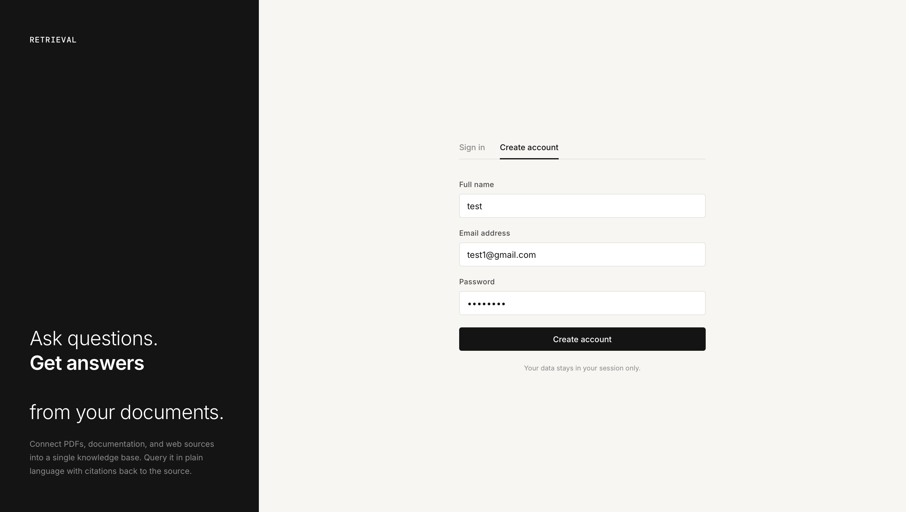
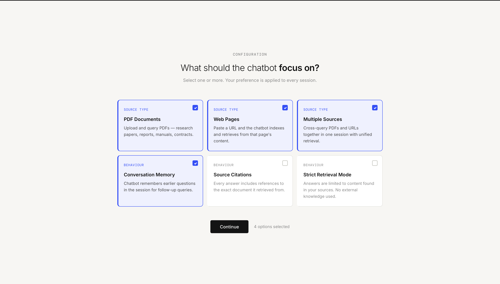
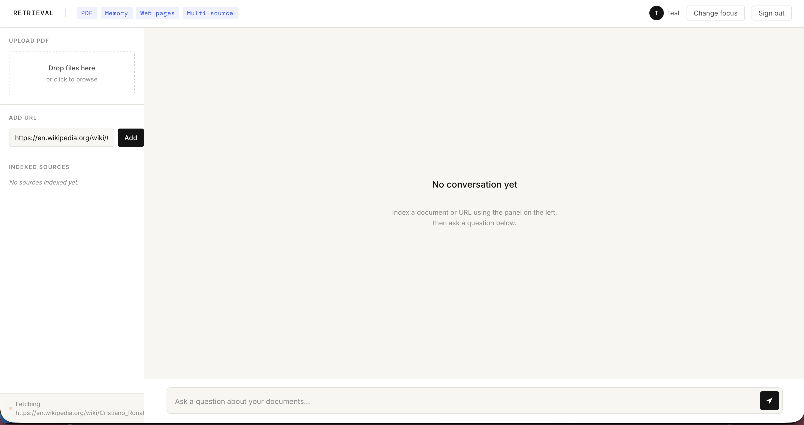
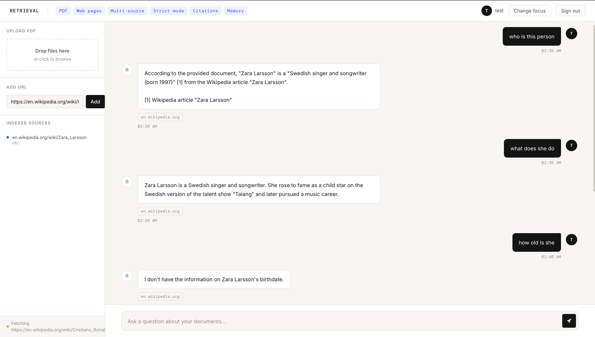

# Retrieval — RAG Chatbot

Ask questions and get answers from your own documents. Upload PDFs or paste URLs, and query them in plain language with source citations, conversation memory, and multi-document retrieval.

Built as a full-stack Retrieval-Augmented Generation (RAG) system: a FastAPI backend that handles ingestion and retrieval, and a lightweight static frontend for interacting with it.

### Live URL : https://retrieval-rag-chatbot.vercel.app

# App Preview 

#### Main Page  

---
#### Configuration 

---
#### Upload URL/PDF 

---
#### Working Model 

---


## Features

- **PDF ingestion** : upload one or more PDFs and have them chunked, embedded, and indexed for retrieval
- **URL ingestion** : paste any web page URL and index its content the same way
- **Multi-source querying** : combine PDFs and URLs in a single session and query across all of them together
- **Conversational memory** : follow-up questions resolve pronouns and context from earlier turns (e.g. "who is she?" correctly resolves to a person mentioned two questions earlier)
- **Source citations** : every answer includes the document or URL it was retrieved from
- **Strict retrieval mode** : optionally constrain answers to only the indexed content, with no outside knowledge
- **Session-based** : each conversation gets its own isolated vector store; no persistence beyond the session

## Tech Stack

**Backend**
- [FastAPI](https://fastapi.tiangolo.com/) — API framework
- [LangChain](https://www.langchain.com/) — retrieval and conversation chain orchestration
- [FAISS](https://github.com/facebookresearch/faiss) — vector similarity search
- [Hugging Face Inference Providers](https://huggingface.co/docs/inference-providers) — text embeddings (`sentence-transformers/all-MiniLM-L6-v2`)
- [Groq](https://groq.com/) — LLM inference (Llama 3.1 8B Instant)
- `PyPDFLoader` / `WebBaseLoader` — document and web page loading

**Frontend**
- Static HTML, CSS, and vanilla JavaScript , no build step or framework dependency
- Deployed on [Vercel](https://vercel.com/)

**Hosting**
- Backend: [Render](https://render.com/) (free tier web service)
- Frontend: Vercel (https://retrieval-rag-chatbot.vercel.app)(free tier web service)

## Architecture

```
┌─────────────┐           ┌──────────────────┐           ┌────────────────┐
│  Frontend   │ ──HTTP──▶ │   FastAPI Backend│ ──calls─▶ │  Groq (LLM)    │
│  (Vercel)   │           │   (Render)       │           │ HF (Embeddings)│
└─────────────┘           └──────────────────┘           └────────────────┘
                                  │
                                  ▼
                          ┌───────────────┐
                          │  FAISS index  │
                          │  (in-memory)  │
                          └───────────────┘
```

Each user session gets a unique `session_id`. Documents ingested under that session are chunked, embedded, and added to a dedicated FAISS vector store. Chat requests retrieve the top-k relevant chunks and pass them, along with conversation history, to the LLM for answer generation.

## Getting Started

### Prerequisites

- Python 3.11+
- A [Groq API key](https://console.groq.com/keys)
- A [Hugging Face access token](https://huggingface.co/settings/tokens) with **"Make calls to Inference Providers"** permission enabled

### Backend Setup

```bash
cd backend
python -m venv venv
source venv/bin/activate  # Windows: venv\Scripts\activate
pip install -r requirements.txt
```

Create a `.env` file in `backend/`:

```env
GROQ_API_KEY=your_groq_api_key_here
HF_TOKEN=your_huggingface_token_here
```

Run the server:

```bash
uvicorn main:app --reload
```

The API will be available at `http://localhost:8000`.

### Frontend Setup

The frontend is a single static HTML file with no build step. Open `frontend/index.html` directly in a browser, or serve it locally:

```bash
cd frontend
python -m http.server 5500
```

Update the `API` constant in `index.html` to point to your backend URL:

```js
const API = "http://localhost:8000"; // or your deployed backend URL
```

## Deployment

### Backend (Render)

1. Push the repo to GitHub
2. Create a new **Web Service** on Render, pointing to the `backend/` directory
3. Build command: `pip install -r requirements.txt`
4. Start command: `uvicorn main:app --host 0.0.0.0 --port $PORT`
5. Add environment variables: `GROQ_API_KEY`, `HF_TOKEN`

### Frontend (Vercel)

1. Create a new project on Vercel, pointing to the `frontend/` directory as the root
2. Framework preset: **Other** (no build step required)
3. Deploy — Vercel will serve `index.html` directly

## API Reference

| Method   | Endpoint                | Description                                    |
|----------|-------------------------|------------------------------------------------|
| `GET`    | `/`                     | Health check                                   |
| `POST`   | `/ingest/pdf`           | Upload and index a PDF file                    |
| `POST`   | `/ingest/url`           | Fetch and index one or more URLs               |
| `POST`   | `/chat`                 | Ask a question against an indexed session      |
| `GET`    | `/session/{session_id}` | Get metadata about a session's indexed sources |
| `DELETE` | `/session/{session_id}` | Clear a session and its index                  |

## Known Limitations

- **Sessions are in-memory only.** A backend restart (deploy, crash, or Render's free-tier idle spin-down) clears all indexed documents and chat history. This is by design for the current scope, not a bug.
- **Free-tier cold starts.** On Render's free plan, the backend spins down after ~15 minutes of inactivity. The first request after idle time can take 30–60 seconds to respond.
- **Rate limits.** Both Groq and Hugging Face's free tiers have usage limits; heavy or sustained use may hit them.

## Possible Future Improvements

- Persistent storage (e.g. a lightweight database or disk-backed vector store) so sessions survive restarts
- User authentication tied to a real backend, rather than local demo accounts
- Support for additional document types (DOCX, TXT, CSV)
- Streaming responses for faster perceived latency

## License

Made by Kanan Sharma, 2026 
